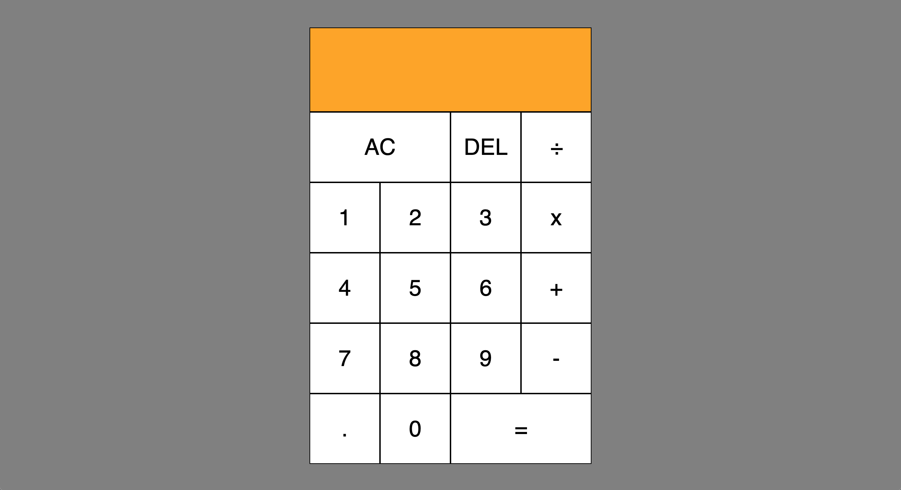

# Calculator-app

## Description

This is a calculator app built using vanilla Javascript, CSS, and HTML. It is largely based on the tutorial done by <a href="https://www.youtube.com/watch?v=j59qQ7YWLxw&feature=emb_title"> Web Dev Simplified</a>. The tutorial was immensely thorough, and I learned a ton following the setup and the logic behind it. 

## Screenshot

